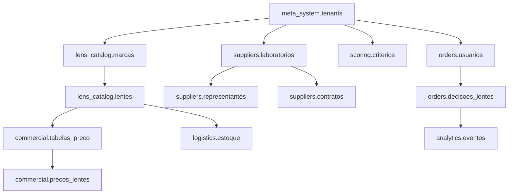

# 📊 Estratégia Completa de População do Banco de Dados - SIS Lens

## 🎯 Objetivos do Documento

Este documento define a estratégia completa para popular o banco de dados do sistema SIS Lens, incluindo ordem de inserção, tipos de dados necessários, fontes de informação e scripts automatizados.

---

## 📋 Análise das Tabelas e Dependências

### 🔗 **Ordem de População (Por Dependências)**



---

## 🗄️ **Estrutura Detalhada por Schema**

### 1. 🏢 **META_SYSTEM** (Fundação do Sistema)

#### **Tabela: tenants**
```sql
-- Dados necessários para começar
INSERT INTO meta_system.tenants (nome, slug, configuracoes) VALUES
('SIS Lens Demo', 'bestlens-demo', '{"tema": "azul", "moeda": "BRL"}'),
('Ótica Central', 'otica-central', '{"tema": "verde", "moeda": "BRL"}');
```

**Dados Mínimos Necessários:**
- ✅ 1 tenant principal para demonstração
- ✅ Configurações básicas (tema, moeda, timezone)

---

### 2. 👁️ **LENS_CATALOG** (Catálogo Técnico)

#### **Tabela: marcas**
```sql
-- Marcas principais do mercado óptico brasileiro
INSERT INTO lens_catalog.marcas (tenant_id, nome, pais_origem) VALUES
-- Nacionais
($tenant_id, 'Essilor', 'França'),
($tenant_id, 'Zeiss', 'Alemanha'), 
($tenant_id, 'Hoya', 'Japão'),
($tenant_id, 'Rodenstock', 'Alemanha'),
($tenant_id, 'Shamir', 'Israel'),
-- Brasileiras
($tenant_id, 'Orgalent', 'Brasil'),
($tenant_id, 'Cristal', 'Brasil'),
($tenant_id, 'Nova Lente', 'Brasil');
```

#### **Tabela: lentes**
**Dados Críticos por Marca:**

**ESSILOR** (Líder mundial)
- ✅ Varilux (progressivas): X Series, Comfort, Liberty
- ✅ Crizal (antirreflexo): Sapphire, Forte, Easy
- ✅ Transitions (fotossensíveis): Signature, XTRActive

**ZEISS** (Premium alemã)
- ✅ Progressive Individual: MyView, SmartLife
- ✅ DuraVision: Platinum, BlueProtect
- ✅ PhotoFusion: Clear, Brown, Grey

**HOYA** (Tecnologia japonesa)
- ✅ iD MyStyle: Lifestyle, WorkStyle
- ✅ Hi-Vision: LongLife, BlueControl
- ✅ Sensity: Dark, Light

```sql
-- Exemplo estruturado por categoria
INSERT INTO lens_catalog.lentes (
    tenant_id, sku_canonico, marca_id, familia, design, 
    material, indice_refracao, tratamentos, tipo_lente, 
    corredor_progressao, specs_tecnicas
) VALUES
-- ESSILOR Varilux X Series
($tenant_id, 'ESS-VAR-X4D-1.50', $essilor_id, 'Varilux', 'X 4D', 
 'organico', 1.50, '{"antirreflexo","antirrisco"}', 'progressiva', 
 14, '{"tecnologia": "4D", "personalizacao": "total"}'),

-- ZEISS SmartLife Individual
($tenant_id, 'ZEI-SL-IND-1.67', $zeiss_id, 'SmartLife', 'Individual Progressive', 
 'organico', 1.67, '{"duratech","blue_protect"}', 'progressiva', 
 12, '{"age_intelligence": true, "digital_optimized": true}');
```

---

### 3. 🏭 **SUPPLIERS** (Fornecedores)

#### **Tabela: laboratorios**
```sql
-- Laboratórios principais do Brasil
INSERT INTO suppliers.laboratorios (tenant_id, nome, cnpj, estado, cidade) VALUES
($tenant_id, 'Essilor do Brasil', '01.234.567/0001-89', 'SP', 'São Paulo'),
($tenant_id, 'Carl Zeiss Vision Brasil', '02.345.678/0001-90', 'SP', 'São Paulo'),
($tenant_id, 'Hoya Lens Brasil', '03.456.789/0001-01', 'RJ', 'Rio de Janeiro'),
($tenant_id, 'Laboratório Orgalent', '04.567.890/0001-12', 'SP', 'Santo André');
```

#### **Tabela: representantes**
```sql
-- Representantes comerciais por região
INSERT INTO suppliers.representantes (laboratorio_id, nome, email, telefone, regioes_atendimento) VALUES
($essilor_id, 'João Silva', 'joao@essilor.com.br', '(11) 99999-1111', '["SP", "RJ", "MG"]'),
($zeiss_id, 'Maria Santos', 'maria@zeiss.com.br', '(11) 88888-2222', '["SP", "PR", "SC"]');
```

---

### 4. 💰 **COMMERCIAL** (Preços e Condições)

#### **Tabela: tabelas_preco**
```sql
-- Tabelas de preço por laboratório
INSERT INTO commercial.tabelas_preco (laboratorio_id, nome, vigencia_inicio, vigencia_fim) VALUES
($essilor_id, 'Tabela Essilor 2025', '2025-01-01', '2025-12-31'),
($zeiss_id, 'Tabela Zeiss Premium 2025', '2025-01-01', '2025-12-31');
```

#### **Tabela: precos_lentes**
```sql
-- Preços detalhados por lente
INSERT INTO commercial.precos_lentes (tabela_id, lente_id, preco_base, preco_esferico, preco_cilindrico, desconto_maximo) VALUES
-- Essilor Varilux X Series
($tab_essilor_id, $varilux_x_id, 450.00, 500.00, 550.00, 0.15),
-- Zeiss SmartLife
($tab_zeiss_id, $smartlife_id, 520.00, 580.00, 630.00, 0.12);
```

---

### 5. 📦 **LOGISTICS** (Estoque e Movimentação)

#### **Tabela: estoque**
```sql
-- Controle de estoque por laboratório
INSERT INTO logistics.estoque (laboratorio_id, lente_id, quantidade_disponivel, prazo_entrega_dias) VALUES
($essilor_id, $varilux_x_id, 150, 3),
($zeiss_id, $smartlife_id, 80, 5);
```

---

### 6. ⭐ **SCORING** (Critérios de Decisão)

#### **Tabela: criterios**
```sql
-- Critérios para algoritmo de recomendação
INSERT INTO scoring.criterios (tenant_id, nome, peso, tipo_criterio, ativo) VALUES
($tenant_id, 'Qualidade da Marca', 0.25, 'qualitativo', true),
($tenant_id, 'Preço Competitivo', 0.30, 'quantitativo', true),
($tenant_id, 'Prazo de Entrega', 0.20, 'quantitativo', true),
($tenant_id, 'Disponibilidade', 0.15, 'quantitativo', true),
($tenant_id, 'Margem de Lucro', 0.10, 'quantitativo', true);
```

---

## 📊 **Volumes de Dados Estimados**

### **MVP (Mínimo Viável)**
- ✅ **Marcas**: 8 principais (Essilor, Zeiss, Hoya, etc.)
- ✅ **Lentes**: ~100 modelos básicos por marca
- ✅ **Laboratórios**: 10-15 principais do Brasil
- ✅ **Preços**: Tabelas atuais (2025)

### **Produção Completa**
- 🎯 **Marcas**: 15-20 marcas completas
- 🎯 **Lentes**: 2.000-3.000 produtos
- 🎯 **Laboratórios**: 50+ laboratórios
- 🎯 **Histórico**: 6 meses de dados simulados

---

## 🤖 **Scripts de População Automatizada**

### **Script 1: Dados Básicos**
```sql
-- scripts/001_dados_basicos.sql
-- Tenants, marcas principais, laboratórios básicos
```

### **Script 2: Catálogo Essilor**
```sql
-- scripts/002_catalogo_essilor.sql  
-- Linha completa Essilor (Varilux, Crizal, Transitions)
```

### **Script 3: Catálogo Zeiss**
```sql
-- scripts/003_catalogo_zeiss.sql
-- Linha Zeiss (SmartLife, Individual, DuraVision)
```

### **Script 4: Preços e Comercial**
```sql
-- scripts/004_precos_comercial.sql
-- Tabelas de preço atuais, descontos, condições
```

### **Script 5: Dados Simulados**
```sql
-- scripts/005_dados_simulados.sql
-- Histórico de decisões, analytics, movimentação
```

---

## 📋 **Fontes de Dados**

### **Dados Reais Necessários**
1. **📧 Contato com Laboratórios**
   - Tabelas de preço oficiais
   - Catálogos técnicos atualizados
   - Condições comerciais

2. **🔍 Pesquisa de Mercado**
   - Sites oficiais das marcas
   - Distribuidores regionais
   - Praças comerciais

### **Dados que Podemos Simular**
1. **📊 Histórico de Decisões**
2. **📈 Métricas de Performance**
3. **🎯 Padrões de Uso**

---

## 🚀 **Plano de Execução**

### **Fase 1: Fundação (Semana 1)**
- ✅ Estrutura básica (tenants, marcas, laboratórios)
- ✅ Catálogo Essilor completo
- ✅ Preços básicos

### **Fase 2: Expansão (Semana 2)**
- 🎯 Catálogo Zeiss e Hoya
- 🎯 Laboratórios regionais
- 🎯 Sistema de scoring

### **Fase 3: Dados Reais (Semana 3)**
- 🎯 Contato com fornecedores
- 🎯 Integração de preços reais
- 🎯 Validação com especialistas

### **Fase 4: Otimização (Semana 4)**
- 🎯 Dados históricos simulados
- 🎯 Analytics e métricas
- 🎯 Ajustes baseados em feedback

---

## 🎯 **Próximos Passos Imediatos**

1. **📝 Aprovar esta estratégia**
2. **🔨 Criar scripts SQL estruturados**
3. **📊 Definir dados prioritários**
4. **🚀 Executar população básica**

**O que você acha desta abordagem? Vamos começar criando os scripts SQL estruturados?** 🤔