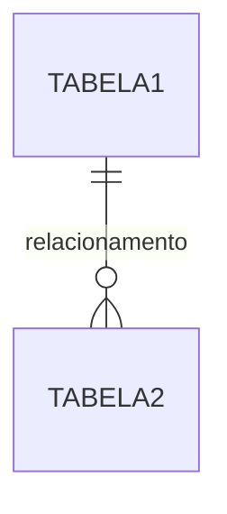

# Análise do Banco de Dados Real

## Data da Análise
[Preencher data]

## Schemas Encontrados

| Schema | Owner | Descrição | Tabelas |
|--------|-------|-----------|---------|
| public | - | Schema padrão | - |
| interno | - | [Descrever] | - |
| [outros] | - | - | - |

## Tabelas Principais

### Schema: public

| Tabela | Registros | Tamanho | Descrição |
|--------|-----------|---------|-----------|
| - | - | - | - |

### Schema: interno

| Tabela | Registros | Tamanho | Descrição |
|--------|-----------|---------|-----------|
| - | - | - | - |

## Relacionamentos Importantes

## Views Existentes

| View | Schema | Descrição | Tabelas Base |
|------|--------|-----------|--------------|
| - | - | - | - |

## Funções/Procedures

| Função | Schema | Tipo | Descrição |
|--------|--------|------|-----------|
| - | - | - | - |

## Tipos Customizados (ENUMs)

| Tipo | Schema | Valores |
|------|--------|---------|
| - | - | - |

## Políticas RLS

| Tabela | Policy | Descrição |
|--------|--------|-----------|
| - | - | - |

## Observações

### Problemas Encontrados
- 

### Melhorias Sugeridas
- 

### Dados de Migração
- Total de registros:
- Tabelas críticas:
- Dependências:

## Próximos Passos

1. [ ] Validar estrutura atual
2. [ ] Mapear relacionamentos
3. [ ] Planejar migração
4. [ ] Criar scripts de migração
5. [ ] Testar em ambiente dev
