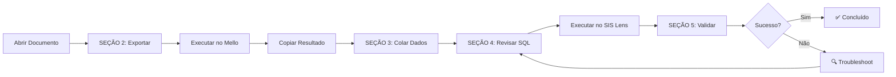

# 📦 GUIA DE MIGRAÇÃO - Mello → SIS Lens

> **Objetivo**: Migrar dados operacionais do sistema Mello para SIS Lens  
> **Estratégia**: Manual, iterativa, baseada em CSV/SQL  
> **Status**: Setup inicial concluído, pronto para migrações

---

## 🎯 VISÃO GERAL

### **Sistemas Envolvidos**

| Sistema | Tipo | Supabase Project | Status |
|---------|------|------------------|--------|
| **Mello** | Origem | `xqizvhugjqpkzgjuflsp` | ✅ Acessível |
| **SIS Lens** | Destino | `ummrbydexhstaxfdcfpn` | ✅ Preparado |

### **Volume de Dados**

| Entidade | Registros | Complexidade | Prioridade |
|----------|-----------|--------------|------------|
| Fornecedores → Laboratórios | 11 | 🟢 Baixa | 1️⃣ Alta |
| Marcas | 6 | 🟢 Baixa | 2️⃣ Alta |
| Lentes Canônicas | 265 | 🟡 Média | 3️⃣ Alta |
| Lentes Premium (Essilor) | 21 | 🟡 Média | 4️⃣ Alta |
| Produtos de Laboratório | 1.411 | 🔴 Alta | 5️⃣ Alta |
| Tabelas de Preço | ~10 | 🟢 Baixa | 6️⃣ Média |
| Preços de Produtos | 1.411 | 🟡 Média | 7️⃣ Média |
| Prazos de Entrega | 16 | 🟢 Baixa | 8️⃣ Baixa |

**Total estimado**: ~3.150 registros

---

## 📋 DOCUMENTOS DE MIGRAÇÃO

### **Setup Inicial**
- ✅ [`00_SETUP_INICIAL_BESTLENS.md`](./00_SETUP_INICIAL_BESTLENS.md)
  - Status: **CONCLUÍDO** ✅
  - Tenant criado: `550e8400-e29b-41d4-a716-446655440000`
  - Data: 06/10/2025 18:12 BRT

### **Migrações de Dados**

| # | Documento | Origem → Destino | Registros | Status |
|---|-----------|------------------|-----------|--------|
| 01 | [`01_MIGRACAO_FORNECEDORES.md`](./01_MIGRACAO_FORNECEDORES.md) | `pessoas.fornecedores` → `suppliers.laboratorios` | 11 | ✅ **Concluído** |
| 02 | `02_MIGRACAO_MARCAS.md` | `produtos.marcas` → `suppliers.marcas` | 6 | ⏳ Pendente |
| 03 | `03_MIGRACAO_LENTES_CANONICAS.md` | `produtos.lentes` → `lens_catalog.lentes_canonicas` | 265 | ⏳ Pendente |
| 04 | `04_MIGRACAO_LENTES_PREMIUM.md` | `produtos.lentes_essilor` → `lens_catalog.lentes_premium` | 21 | ⏳ Pendente |
| 05 | `05_MIGRACAO_PRODUTOS.md` | `produtos.produtos_fornecedor` → `suppliers.produtos_laboratorio` | 1.411 | ⏳ Pendente |
| 06 | `06_MIGRACAO_PRECOS.md` | Múltiplas → `commercial.*` | ~1.421 | ⏳ Pendente |
| 07 | `07_MIGRACAO_PRAZOS.md` | `produtos.prazos_entrega` → `logistics.prazos_entrega` | 16 | ⏳ Pendente |

---

## 🚀 COMO EXECUTAR UMA MIGRAÇÃO

### **1. Pré-requisitos**
- [ ] Setup inicial concluído (`00_SETUP_INICIAL_BESTLENS.md`)
- [ ] Acesso ao Supabase Mello (origem)
- [ ] Acesso ao Supabase SIS Lens (destino)
- [ ] SQL Editor aberto em ambos os projetos

### **2. Fluxo de Execução**



### **3. Estrutura dos Documentos**

Cada documento de migração contém:

- **SEÇÃO 0**: Pré-requisitos (se houver)
- **SEÇÃO 1**: Comparativo de estruturas (mapeamento campo a campo)
- **SEÇÃO 2**: SQL de exportação (executar no Mello)
- **SEÇÃO 3**: Área para colar dados exportados
- **SEÇÃO 4**: SQL de importação (gerado/executar no SIS Lens)
- **SEÇÃO 5**: Queries de validação (confirmar sucesso)

---

## 🎯 DECISÕES TÉCNICAS

### **Preservação de UUIDs**
✅ **Decisão**: Manter UUIDs originais do Mello  
**Motivo**: Facilita rastreabilidade e troubleshooting

### **Tenant ID Único**
✅ **Decisão**: Usar UUID fixo para todas as migrações  
**UUID**: `550e8400-e29b-41d4-a716-446655440000`  
**Tenant**: Óticas Taty Mello

### **Agregação JSONB**
✅ **Decisão**: Agrupar múltiplos campos relacionados em JSONB  
**Exemplo**: Contatos de fornecedores (email, telefone, whatsapp, etc)  
**Motivo**: Flexibilidade e evolução do schema

### **Ordem de Migração**
✅ **Decisão**: Respeitar dependências de Foreign Keys  
**Ordem**:
1. Tenants (meta_system) ✅
2. Laboratórios (suppliers)
3. Marcas (suppliers)
4. Lentes (lens_catalog)
5. Produtos (suppliers) → depende de laboratórios, marcas, lentes
6. Preços (commercial) → depende de produtos
7. Prazos (logistics) → depende de laboratórios

---

## ⚠️ PONTOS DE ATENÇÃO

### **1. Encoding de Caracteres**
- Dados do Mello podem conter caracteres especiais (`ã`, `ç`, `é`)
- Sempre usar UTF-8 nas exportações/importações

### **2. Valores NULL**
- Alguns campos opcionais podem ser NULL
- Usar `COALESCE()` para defaults quando necessário

### **3. Timestamps**
- Preservar `created_at` original quando possível
- `updated_at` sempre NOW() na importação

### **4. Constraints**
- Verificar Foreign Keys antes de importar
- Unique constraints podem falhar se houver duplicatas

---

## 📊 PROGRESSO GERAL

### **Setup**
- [x] ✅ Banco SIS Lens criado
- [x] ✅ Schemas criados (8)
- [x] ✅ Tabelas criadas
- [x] ✅ Views criadas
- [x] ✅ Tenant principal criado
- [x] ✅ RLS configurado

### **Migrações**
- [x] ✅ 01 - Fornecedores (11) - **CONCLUÍDO** 🎉
- [ ] 02 - Marcas (6)
- [ ] 03 - Lentes Canônicas (265)
- [ ] 04 - Lentes Premium (21)
- [ ] 05 - Produtos (1.411)
- [ ] 06 - Preços (~1.421)
- [ ] 07 - Prazos (16)

**Progresso**: 1/7 migrações (14,3%)  
**Registros migrados**: 11/3.150 (0,35%)  
**Última atualização**: 06/10/2025 - 18:30 BRT

---

## 🛠️ FERRAMENTAS

### **Supabase SQL Editor**
- URL Mello: `https://supabase.com/dashboard/project/xqizvhugjqpkzgjuflsp/sql`
- URL SIS Lens: `https://supabase.com/dashboard/project/ummrbydexhstaxfdcfpn/sql`

### **Comandos Úteis**

```sql
-- Ver estrutura de uma tabela
SELECT column_name, data_type, is_nullable
FROM information_schema.columns
WHERE table_schema = 'schema_name' AND table_name = 'table_name';

-- Contar registros por tabela
SELECT COUNT(*) FROM schema_name.table_name;

-- Validar JSONB
SELECT jsonb_pretty(campo_jsonb) FROM tabela LIMIT 1;

-- Ver Foreign Keys
SELECT
    tc.constraint_name,
    tc.table_name,
    kcu.column_name,
    ccu.table_name AS foreign_table_name,
    ccu.column_name AS foreign_column_name
FROM information_schema.table_constraints AS tc
JOIN information_schema.key_column_usage AS kcu
  ON tc.constraint_name = kcu.constraint_name
JOIN information_schema.constraint_column_usage AS ccu
  ON ccu.constraint_name = tc.constraint_name
WHERE tc.constraint_type = 'FOREIGN KEY'
  AND tc.table_schema = 'schema_name';
```

---

## 📞 SUPORTE

### **Documentação de Referência**
- [Blueprint Completo](../📐%20Blueprint%20Completo%20—%20Sistema%20Decisor%20de%20Lentes.md)
- [Análise de Migração Completa](../ANALISE_MIGRACAO_COMPLETA.md)
- [Stack Tecnológica](../🔧%20Definição%20de%20Stack%20Tecnológica%20—%20Sistema%20Decisor%20de%20Lentes.md)

### **Em Caso de Problemas**
1. Verificar logs de erro no Supabase
2. Consultar seção TROUBLESHOOTING do documento específico
3. Validar estruturas com queries de information_schema
4. Conferir Foreign Keys e Constraints

---

## ✅ CHECKLIST DE CONCLUSÃO

Uma migração é considerada concluída quando:

- [ ] Query de exportação executada sem erros
- [ ] Dados exportados e colados no documento
- [ ] SQL de importação gerado e revisado
- [ ] Importação executada sem erros (COMMIT bem-sucedido)
- [ ] Todas as validações da SEÇÃO 5 aprovadas
- [ ] Contagem de registros confere (origem = destino)
- [ ] UUIDs preservados (amostragem)
- [ ] Foreign Keys respeitadas
- [ ] JSONB bem formatado (se aplicável)
- [ ] Documento atualizado com status ✅

---

**Última atualização**: 06/10/2025 - 18:30 BRT  
**Responsável**: Migração Mello → SIS Lens  
**Próxima ação**: Executar `01_MIGRACAO_FORNECEDORES.md`
